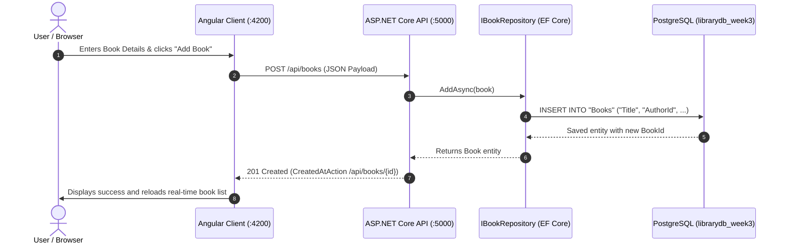

# 🏛️ Database-Backed Library Portal & AI Automation
### Week 3 — Capstone Project: PostgreSQL, EF Core, Angular Client & Python AI

**Author:** Muhammad Qasim  
**Program:** AI Software Development Internship (.NET + Angular + AI)  
**Milestone:** Week 3 Final Project — Persistent Enterprise Integration  

[](https://dotnet.microsoft.com/)
[](https://www.postgresql.org/)
[](https://learn.microsoft.com/ef/core/)
[](https://angular.dev/)
[](https://github.com/)

---

## 📌 Overview
This directory serves as the integrated project workspace combining all components mastered in Parts A through G into a unified solution.

## 🏗️ Complete End-to-End Data Flow


## 🛠️ Tech Stack & Key Components
- **Backend API**: ASP.NET Core 8 Web API (`libraryAPI`) with Controllers, Swagger, and DI.
- **Database ORM**: Entity Framework Core 8 with PostgreSQL (`Npgsql.EntityFrameworkCore.PostgreSQL`).
- **Configuration Security**: `.env` parser dynamically resolves credentials without hardcoded strings.
- **Frontend SPA**: Standalone Angular 18+ components, Reactive Forms, dynamic loading spinner, and error alert banners.
- **Auth Foundation**: `User` entity & `AuthController` skeleton for login/register testing (JWT issuance scheduled for Week 4).
- **AI Track**: Standalone Python script querying Google Gemini API (`gemini-flash-latest`) for rich, contextual book summaries and genre recommendations with daily-refreshing free-tier support.


## 📡 API Endpoints Reference Table

| Method | Endpoint | Description | Request Body | Auth Required |
| :--- | :--- | :--- | :--- | :--- |
| `GET` | `/api/books` | Retrieve all books with authors and categories | None | No |
| `GET` | `/api/books/{id}` | Retrieve single book by ID | None | No |
| `POST` | `/api/books` | Create a new book record | `Book` JSON payload | No |
| `PUT` | `/api/books/{id}` | Update existing book details | `Book` JSON payload | No |
| `DELETE`| `/api/books/{id}` | Delete book by ID | None | No |
| `POST` | `/api/auth/register`| Register new user (Auth skeleton) | `{ "username", "passwordHash", "role" }` | No |
| `POST` | `/api/auth/login` | Authenticate user (Auth skeleton) | `{ "username", "password" }` | No |

## 🚀 Execution & Verification Guide

### 1. Database & Backend API
```bash
cd Week_03/Week_03_Final_Project/backend

# Verify .env credentials (POSTGRES_HOST, PORT, DB, USER, PASSWORD)
# Run .NET API (starts on http://localhost:5000)
dotnet run
```
Access Swagger UI at: `http://localhost:5000/swagger`

### 2. Angular Client Application
```bash
cd Week_03/Week_03_Final_Project/frontend

# Install dependencies if not already present
npm install

# Start development server
npm start
```
Open your browser at `http://localhost:4200` to interact with the responsive book directory, real-time feedback notifications, and book creation form.

### 3. Standalone AI Summary Script (Google Gemini)
```bash
cd Week_03/Week_03_Final_Project/ai-services

# Install requirements inside the dedicated AI virtual environment
& "D:\Software\PythonEnvironments\AI_env\Scripts\python.exe" -m pip install -r requirements.txt

# Run the Gemini summary script
& "D:\Software\PythonEnvironments\AI_env\Scripts\python.exe" summarize_book.py "Nuskha-Hai-Wafa" "Faiz Ahmed Faiz poetry collection covering themes of love, struggle, and justice."
```

---

## 👤 Author

- **Name:** Muhammad Qasim  
- **Internship:** AI Software Development Internship (.NET + Angular + AI)


