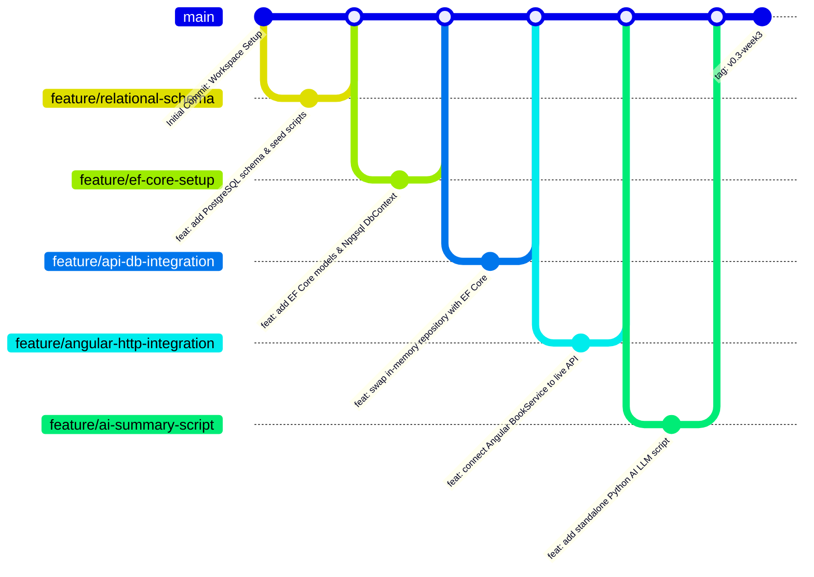

# Week 3 - Part F: Git & GitHub Workflow Standards

## 📌 Overview
Starting from Week 3, all software development tasks follow an industry-standard **Git Feature Branching Workflow**, **Conventional Commit Messages**, and **Pull Request (PR)** code review practices. 

Code is never committed as a single massive dump into `main`; instead, each part is developed on isolated feature branches, reviewed, and merged iteratively.

---

## 📖 Core Vocabulary & Concepts

1. **Repository (Repo)**: The centralized directory tracked by Git, preserving the complete timeline, branches, and version history of the codebase.
2. **Commit**: A cryptographically signed snapshot of incremental changes accompanied by a clear message explaining *what* changed and *why*.
3. **Branch**: An isolated parallel workspace allowing new features or risky refactoring to be built without impacting the stable `main` branch.
4. **`.gitignore`**: A root-level configuration file telling Git to exclude build binaries (`bin/`, `obj/`, `dist/`), package managers (`node_modules/`, `.venv/`), and local secrets (`.env`, `appsettings.Development.json`).
5. **Pull Request (PR)**: A formal request on GitHub to merge code from a feature branch into `main`, serving as a mandatory code review checkpoint.
6. **Merge Conflict**: Occurs when two branches modify the exact same lines of a file, requiring explicit developer intervention to resolve cleanly.

---

## 🏷️ Conventional Commits Standard

Every commit message follows the [Conventional Commits](https://www.conventionalcommits.org/) specification using structured prefixes for scannability:

| Prefix | Intended Use Case | Example Commit Message |
| :--- | :--- | :--- |
| `feat:` | A new feature, entity, or functional capability | `feat: add EF Core models and PostgreSQL DbContext` |
| `fix:` | A bug fix or error resolution | `fix: resolve circular reference JSON serialization error` |
| `docs:` | Documentation updates or architecture notes | `docs: add Part D JWT and authentication notes` |
| `chore:` | Environment setup, dependencies, or migrations | `chore: configure CORS policy for Angular port 4200` |
| `refactor:`| Restructuring existing code without behavior changes| `refactor: swap in-memory list with EF Core repository` |

---

## 🌿 Week 3 Feature Branching Strategy

Each part of Week 3 was executed on a dedicated feature branch:



### Command Execution Workflow per Feature:
```bash
# 1. Create and switch to new feature branch
git checkout -b feature/ef-core-setup

# 2. Make incremental working commits
git add .
git commit -m "feat: add EF Core models and LibraryDbContext"

# 3. Push branch to GitHub
git push -u origin feature/ef-core-setup

# 4. Open Pull Request on GitHub -> Review Diff -> Merge into main
```

---

## 🔒 Security Best Practices: Zero Secrets in Source Control

> [!CAUTION]
> **CRITICAL RULE**: Connection strings containing real passwords, private API keys, and local `.env` files must NEVER be committed to Git.

- **Risk**: Once a secret is committed, it remains in Git commit history forever—even if deleted in a later commit.
- **Prevention Strategy**:
  1. All sensitive keys are placed inside `.env` or `appsettings.Development.json`.
  2. Both files are strictly listed inside root [`.gitignore`](file:///d:/Courses%20and%20Internship/Internship/Completed/Internship-by-azeem/Week_wise_sol/Week-03_and_04/Week_03/.gitignore).
  3. Non-sensitive templates (`.env.example`) are committed to document required environment variable keys for fellow developers.

---

## 🚩 Milestone Tagging

Once all feature branches are reviewed and merged into `main`, the milestone release is tagged:
```bash
git tag -a v0.3-week3 -m "Week 3 Completed: EF Core, PostgreSQL, Angular integration, and AI script"
git push origin v0.3-week3
```
