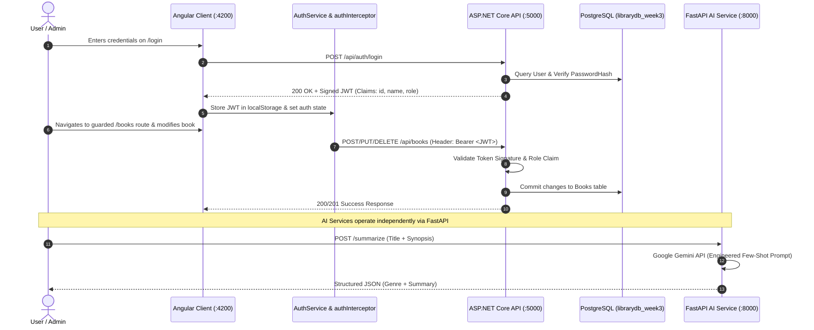

# Week 4 Final Project - Secured Library App (.NET + Angular) + AI Microservice (FastAPI)

## 📌 Overview
This directory serves as the integrated enterprise workspace for **Week 4**, delivering a hardened full-stack architecture:
1. **Secured Backend (.NET 8 Web API)**: Production-grade JWT Bearer token generation, claims authorization (`[Authorize]`, `[Authorize(Roles = "Admin")]`), and secure password hashing via `PasswordHasher<User>`.
2. **Secured Frontend (Angular Standalone)**: Centralized `AuthService`, functional HTTP interceptor (`authInterceptor`) automatically attaching Bearer tokens to modifying requests, route guards (`authGuard`), dynamic Login UI, and role-based button visibility.
3. **AI Microservice (FastAPI + Google Gemini API)**: Standalone AI microservice with Pydantic request validation, engineered prompts (few-shot + role personas), prompt injection defense, and defensive JSON parsing.
4. **Git Branch & Protection Strategy**: Built through isolated feature branches, resolved merge conflicts, and GitHub branch protection.

---

## 🏗️ Architectural Topology & Token Flow



---

## 🛠️ Tech Stack & Key Components

- **Backend API**: ASP.NET Core 8 Web API with JWT Bearer Authentication (`Microsoft.AspNetCore.Authentication.JwtBearer`), Entity Framework Core 8, PostgreSQL (`Npgsql`).
- **Frontend SPA**: Angular 18/19 Standalone Components, Reactive Forms, `HttpInterceptorFn`, `CanActivateFn`.
- **AI Microservice**: FastAPI, Uvicorn, Pydantic v2, Google Gemini API (`google-genai` SDK with `gemini-3.8-flash`), and `.env` configuration.
- **Git Controls**: Pull request template (`.github/PULL_REQUEST_TEMPLATE.md`), branch protection rules on `main`.

---

## 📡 API Endpoints Reference Table

| Method | Endpoint | Service | Description | Auth Required | Minimum Role |
| :--- | :--- | :--- | :--- | :--- | :--- |
| `POST` | `/api/auth/register` | .NET Core | Register new user with hashed password | No | Public |
| `POST` | `/api/auth/login` | .NET Core | Verify password hash & issue signed JWT | No | Public |
| `GET` | `/api/books` | .NET Core | Retrieve book catalog | No | Public |
| `GET` | `/api/books/{id}` | .NET Core | Retrieve book by ID | No | Public |
| `POST` | `/api/books` | .NET Core | Add a new book | **Yes** (Bearer Token) | `User` or `Admin` |
| `PUT` | `/api/books/{id}` | .NET Core | Update book details | **Yes** (Bearer Token) | `User` or `Admin` |
| `DELETE`| `/api/books/{id}` | .NET Core | Delete book record | **Yes** (Bearer Token) | **`Admin` Only** |
| `GET` | `/health` | FastAPI | Health & liveness probe | No | Public |
| `POST` | `/summarize` | FastAPI | Prompt-engineered book summary & genre classification | No | Public |
| `POST` | `/genre-suggestion`| FastAPI | Suggest book genre with confidence score | No | Public |

---

## 🚀 Execution & Verification Guide

### 1. Database & ASP.NET Core Backend
```powershell
cd "Week_04/Week_04_Final_Project/backend"

# Ensure .env and appsettings.Development.json are configured
& "D:\Software\dotnet\dotnet.exe" restore
& "D:\Software\dotnet\dotnet.exe" run
# API runs on http://localhost:5000 | Swagger UI: http://localhost:5000/swagger
```

### 2. Angular Client Application
```powershell
cd "Week_04/Week_04_Final_Project/frontend"

npm install
npm start
# Client runs on http://localhost:4200
```

### 3. FastAPI AI Microservice (Google Gemini)
```powershell
cd "Week_04/Week_04_PartC_FastAPIService"

# Start the FastAPI service using dedicated virtual environment
& "D:\Software\PythonEnvironments\AI_env\Scripts\python.exe" -m uvicorn main:app --reload --port 8000
# Interactive Swagger Docs: http://localhost:8000/docs
```
